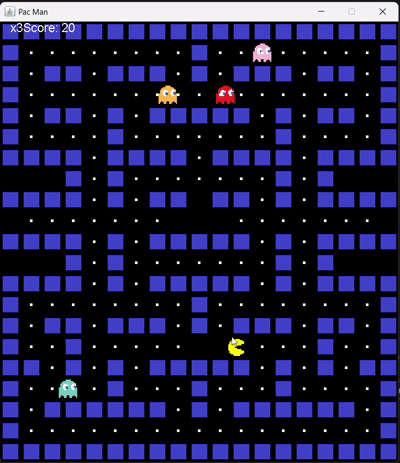

<div align="center">

# 🟡 PAC-MAN
### *Java Swing Arcade Game*


<br/><br/>

🎮 *Waka-waka your way through this classic arcade-inspired Pac-Man game built using Java Swing.*

</div>

---

<div align="center">

## 🎥 Gameplay Preview



</div>

> The gameplay shown above is converted from **`PacMan.mp4`**, which is included in this repository and demonstrates real-time movement, rendering, and controls.


## 👾 About the Project:
This is a **Pac-Man inspired desktop game** developed using **Java Swing**.  
The project focuses on **core game development concepts** such as:
- Real-time rendering
- Keyboard input handling
- Game loop logic
- 2D graphics using Java AWT

The game runs locally and is intended for **educational and academic purposes**.

## ✨ Features:
🟡 Smooth Pac-Man movement  
🎮 Keyboard-controlled gameplay  
🖥 Desktop application using Java Swing  
⚡ Lightweight & fast execution  
♻ Platform-independent (Java-enabled systems)

## 🛠 Tech Stack:
| Technology | Purpose |
|----------|--------|
| **Java** | Core logic |
| **Java Swing** | GUI & window |
| **AWT Graphics** | Rendering |
| **KeyListener** | Controls |

## 🗂 Project Structure
```text
PacMan/
├── App.java        → Application entry point
├── PacMan.java     → Game logic & rendering
├── PacMan.mp4      → Original gameplay recording
├── PacMan.gif      → Autoplay gameplay preview
└── README.md
